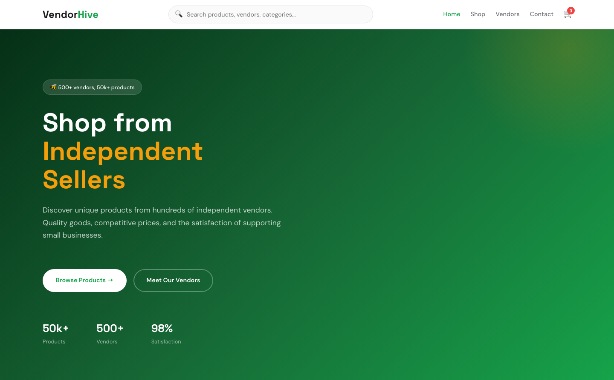

# VENDORHIVE — Multi-Vendor Marketplace

> **Shop from Independent Sellers** — 50k+ products from 500+ vendors. Quality goods, competitive prices, and the satisfaction of supporting small businesses.

## 🏢 What This Is

A premium, framework-free HTML template for multi-vendor e-commerce marketplaces. Green-and-gold palette with product cards, vendor profiles, and deal banners. 4 pages covering platform overview, product catalog, vendor directory, and contact. Built with semantic HTML5, CSS custom properties, and vanilla JavaScript — no dependencies.

## 📄 Pages

| Page | File | Purpose |
|------|------|---------|
| **Home** | [index.html](index.html) | Hero with marketplace stats, category cards, featured products, deal banner, vendor showcase |
| **Shop** | [shop.html](shop.html) | Full product catalog with 8 product cards, pricing, and ratings |
| **Vendors** | [vendors.html](vendors.html) | Vendor directory with profiles and ratings |
| **Contact** | [contact.html](contact.html) | Contact form for vendor applications, support, and partnerships |

## 📸 Screenshot



## 🎨 Design System

| Token | Value | Usage |
|-------|-------|-------|
| `--green` | `#16A34A` | Primary accent, vendor names, CTAs |
| `--gold` | `#F59E0B` | Deal highlights, ratings, badges |
| `--dark` | `#18181B` | Dark sections, text |

**Typography:** Space Grotesk (headings) + DM Sans (body) via Google Fonts  
**Layout:** CSS Grid + Flexbox, `clamp()` responsive sizing

## ⚡ Key Features

- **Search Bar** — Prominent search in the header for product discovery
- **Cart Badge** — Shopping cart icon with item count
- **Product Cards** — With wishlist button, discount badges, vendor attribution, add-to-cart
- **Deal Banner** — Featured deal of the week with pricing
- **Vendor Cards** — Circular avatars with product count and ratings
- **Promo Bar** — Top announcement bar for promotions
- **Scroll Reveal** — IntersectionObserver-powered animations
- **Mobile Responsive** — Full-screen nav overlay, stacked grids

## 📁 File Structure

```
multi-vendor-store-html-template/
├── index.html          # Home page
├── shop.html           # Product catalog
├── vendors.html        # Vendor directory
├── contact.html        # Contact form
├── README.md           # This file
└── assets/
    ├── css/style.css
    ├── js/main.js
    └── img/
        ├── product-1.jpg through product-9.jpg
        ├── vendor-1.jpg through vendor-5.jpg
        ├── category images
        └── offer images
```

## 🚀 Getting Started

Open any `.html` file in a browser — no build step required.

---

*Built with ❤️ — Pure HTML, CSS & vanilla JS. Zero dependencies.*
